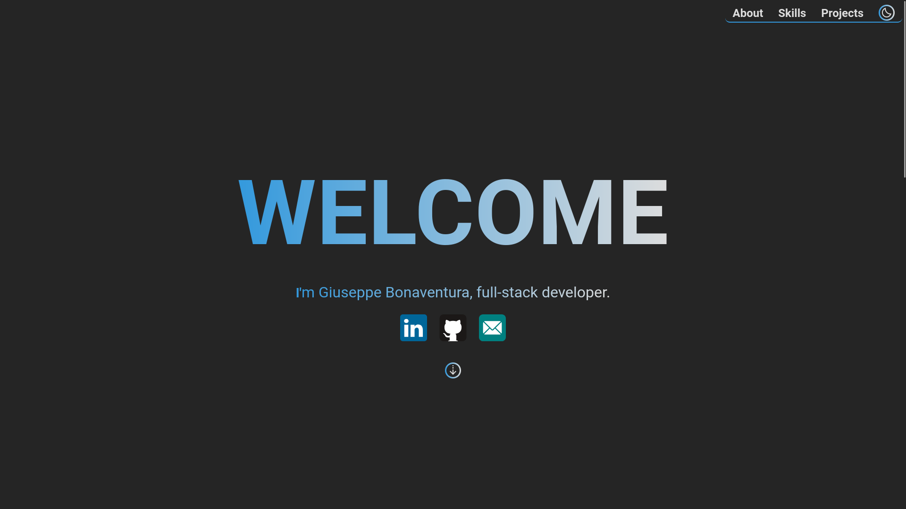

# 🌐 Personal Portfolio

This is my **personal portfolio website**, built with HTML/CSS (and optionally JavaScript) and hosted using **GitHub Pages**.  
It also integrates **GitHub Actions** workflows for CI/CD.

## 🚀 Features
 - Responsive design for desktop and mobile.
 - Python script for updating project data before deploy.
 - Automatic deployment to `https://pippobonasre.github.io` using GitHub Actions.

## 📦 Technologies Used
 - **HTML5**, **CSS3** & **JavaScript**
 - **GitHub Pages** for hosting
 - **GitHub Actions** for CI/CD
 - **Python** for downloading resources

## 🛠 How It Works
1. Push changes to the `main` branch.
2. GitHub Actions workflow runs:
   - Executes the Python script to update data resources (`py/update_data.py`).
   - Deploys the site to GitHub Pages.
3. The site updates automatically at:  
   `https://pippobonas.github.io`

## 📂 Repository Structure
```
/
├── data/ #autogenerate about script python
│   ├── preview/
│   ├── tags/
│   └── repo.json
├── site/
│   ├── favico/
│   ├── icon/
│   ├── img/
│   ├── style/
│   ├── js/
│   ├── home.html
│   └── site.webmanifest
├── py/
│   ├── update_data.py
│   └── requirements.txt
├── .github/
│   └── workflows/
│       └── update-data.yml
├── README.md           
```
## Preview


## 🤝 Contributing
Pull requests are welcome! For major changes, please open an issue first to discuss what you would like to change.

## 📄 License
This project is open source and available under the MIT License.